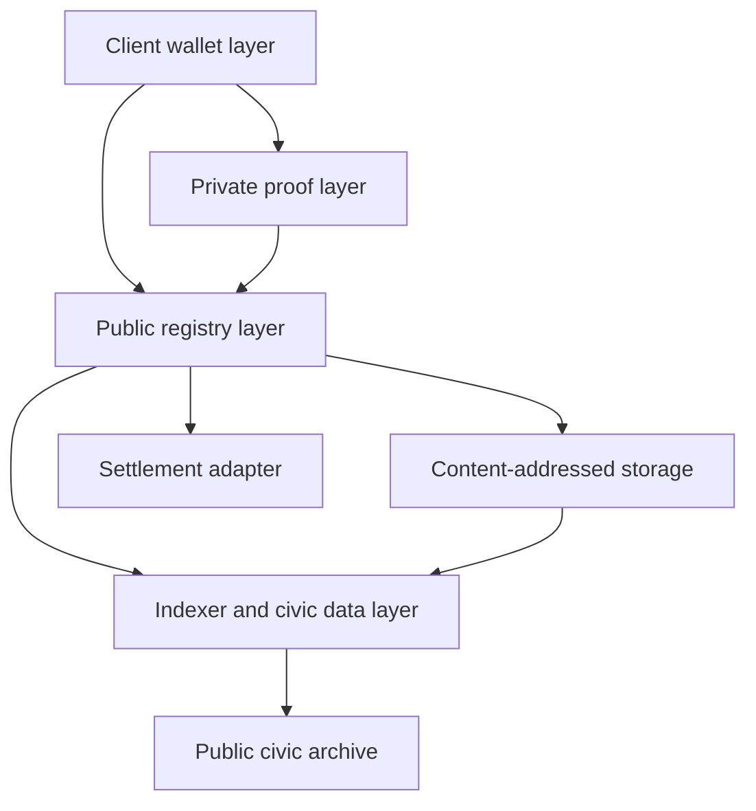
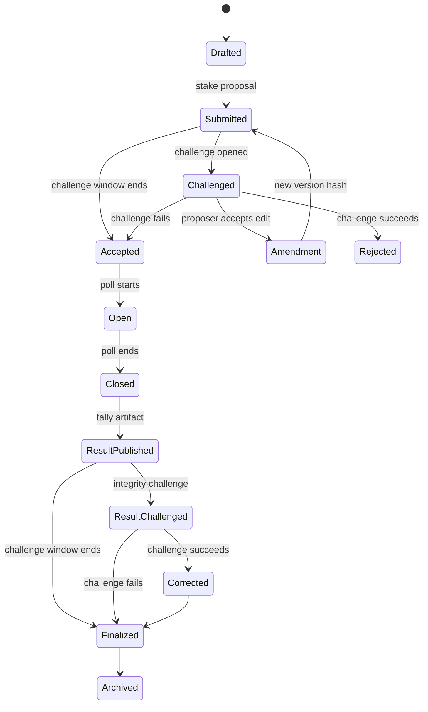
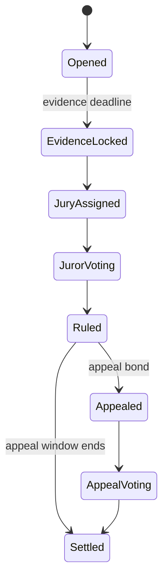
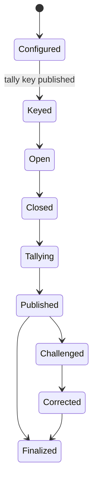
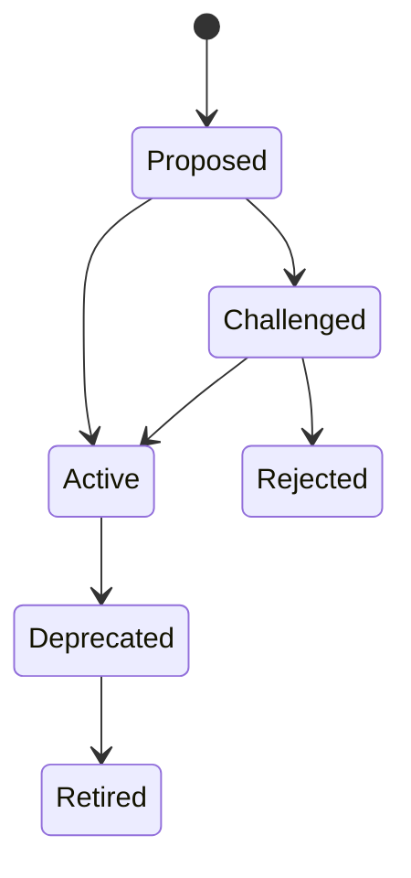
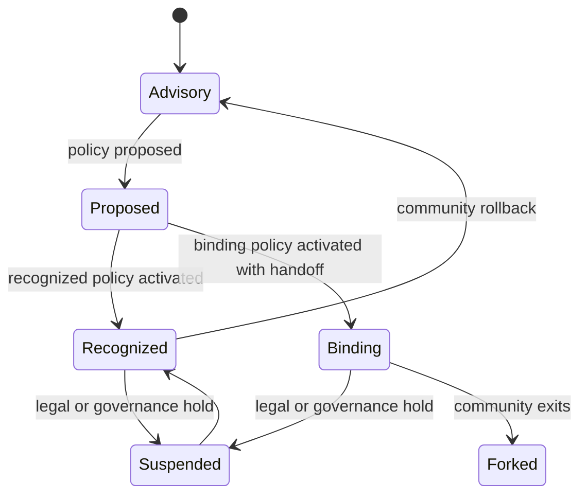
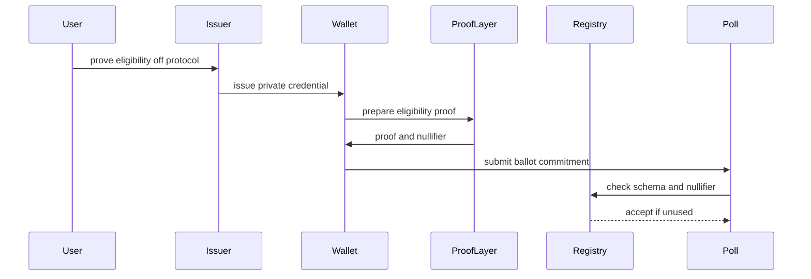
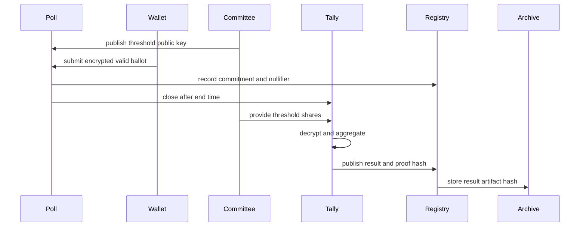
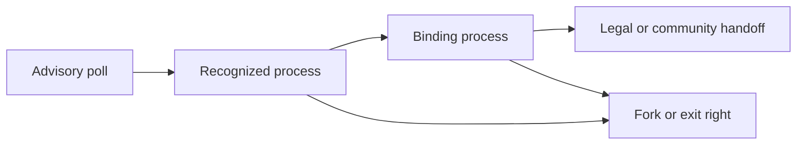

# Popular Consensus Yellow Paper

## MVP Protocol Specification for a ZK-First Civic Appchain

Version: 0.1 draft  
Date: April 27, 2026  
Companion to: `docs/popular-consensus-blueprint-whitepaper.md`

This document is a technical planning draft. It is not legal, tax, investment, or compliance advice. Production launch requires independent legal review, security review, privacy review, and community governance review.

## Abstract

Popular Consensus is a civic signal protocol for public questions, privacy-preserving participation, transparent registry curation, and auditable aggregate results. The MVP is specified as a modular appchain with native utility gas, proposal staking, ZK credentials, encrypted private ballots, and verifiable tally publication.

The protocol is designed to support advisory opinion polling first. It also includes an adoption layer that lets communities later define when a process is recognized or binding under their own rules. The system must never imply binding authority unless a published community adoption policy grants it.

The core primitive is a public question with an auditable lifecycle. A question can be proposed, challenged, amended, accepted, opened for participation, tallied, challenged again on result integrity grounds, finalized, and archived. Each step emits public registry events while individual eligibility proofs and ballots remain private by default.

The MVP has three technical goals:

- Make public questions inspectable.
- Make eligible participation private and duplicate-resistant.
- Make aggregate results verifiable without exposing individual responses.

## 1. Terminology

| Term | Meaning |
| --- | --- |
| Appchain | The Popular Consensus application-specific network that executes registry, staking, poll, and governance logic. |
| PC | Working symbol for the native utility token used for gas, proposal bonds, challenge bonds, appeal bonds, juror rewards, tally rewards, and protocol fees. |
| Question | A structured civic prompt with answer schema, eligibility schema, sponsor disclosure, timing, and methodology label. |
| Registry | Public protocol state that records accepted questions, credential schemas, issuers, communities, challenges, results, and adoption policies. |
| Credential | A private eligibility attestation issued by a registered issuer. |
| Nullifier | A poll-specific value proving a credential was used once without revealing the holder. |
| Ballot | A respondent's encrypted answer payload plus proof material. |
| Tally committee | A threshold group authorized to decrypt and aggregate ballots after poll close. |
| Result artifact | A public bundle containing aggregate results, proof references, methodology, privacy checks, and archive hashes. |
| Adoption policy | A community-published rule set defining whether a class of polls is advisory, recognized, or binding. |
| Reputation | Non-transferable record of useful protocol work. Reputation is not PC and cannot be transferred. |

## 2. Design Invariants

The MVP must preserve these invariants:

- A respondent never receives financial upside for selecting an answer.
- Answer choices are not tokenized.
- There is no order book, answer market, or answer position.
- PC utility is limited to gas, staking, challenge, appeal, juror, tally, treasury, and governance-adjacent functions.
- One valid credential can produce at most one counted ballot per poll unless the poll explicitly allows ballot replacement.
- A public result must identify its eligibility basis, methodology, sponsor, challenge history, and authority status.
- A result is advisory unless a valid adoption policy says otherwise.
- Individual ballots remain private by default.
- Public audit data must not expose personal identity.
- Every state transition must be reproducible from public registry events and content hashes.
- Numeric constants are governance parameters, not hard-coded protocol truths.

## 3. System Overview

Popular Consensus is organized as six layers:

- Client wallet layer: account, credential, proof, encryption, signing, and submission UX.
- Private proof layer: local proof generation for eligibility, answer validity, and nullifier correctness.
- Public registry layer: appchain modules for questions, staking, challenges, credential schemas, ballots, results, reputation, and adoption.
- Storage layer: content-addressed question artifacts, evidence bundles, result artifacts, and public archive exports.
- Indexer and civic data layer: searchable views, public API concepts, dashboards, and audit artifact retrieval.
- Settlement adapter layer: optional anchoring of appchain state roots and result commitments to an external settlement network.

The appchain is modular. It can later target a privacy-first rollup, a recursive-proof chain, or another ZK execution stack without changing the civic protocol surface.



## 4. Protocol Roles

### Respondent

Submits a private ballot for a poll after proving eligibility. A respondent can inspect inclusion by finding the ballot commitment and nullifier record, but cannot use protocol artifacts to reveal the private answer.

### Proposer

Stakes PC to submit a question. The proposer supplies wording, answer schema, eligibility schema, sponsor disclosure, timing, methodology label, and content hashes.

### Challenger

Stakes PC to challenge a question, challenge resolution, credential schema, issuer, result, or adoption policy. Challenges must cite a rule and evidence hash.

### Curator

Reviews questions, proposes amendments, identifies duplicates, and helps maintain registry quality. Curators earn reputation for accepted work.

### Juror

Resolves challenges through a rule-bound decision process. Jurors are selected from eligible reputation pools and receive PC rewards for completed service.

### Credential Issuer

Issues private credentials under an accepted credential schema. Issuers may be civic bodies, community stewards, institutional partners, or audited identity providers.

### Tally Committee

Holds threshold key shares for a poll. After poll close, the committee decrypts valid ballots, computes aggregate results, and publishes proof artifacts.

### Sponsor

Funds a question, outreach effort, tally cost, or research export. Sponsorship is always disclosed on the question page and in the registry.

### Delegate

Receives revocable governance authority from users for protocol governance or community policy decisions. Delegation never grants access to private ballot contents.

### Moderator

Enforces discussion rules and handles content reports. Moderation does not change poll results unless a separate result challenge succeeds.

### Community Steward

Maintains community metadata, local rules, credential requirements, adoption policies, and fork or exit processes for a defined community space.

## 5. Threat Model

The protocol assumes adversaries may:

- Submit spam questions.
- Word questions deceptively.
- Hide sponsor influence.
- Attempt duplicate participation.
- Attempt credential fraud.
- Pressure respondents to reveal choices.
- Attack tally availability.
- Compromise a minority of tally key shares.
- Coordinate bad-faith challenges.
- Attempt juror capture.
- Attempt small-group privacy leakage.
- Publish false off-chain result displays.
- Attack appchain contracts or proof verifiers.

The MVP mitigates these risks through:

- Proposal, challenge, and appeal staking.
- Public version history.
- Credential issuer registry.
- Poll-specific nullifiers.
- Encrypted ballots.
- Threshold tallying.
- Public tally proofs and result artifacts.
- Privacy thresholds for public slices.
- Juror reputation and conflict disclosure.
- Result challenge windows.
- Content-addressed archives.
- Settlement checkpoints.

Out of scope for MVP:

- Perfect coercion resistance.
- Fully trustless tally without a committee.
- Legal recognition of public elections.
- Full demographic representativeness.
- Automated content judgment.

## 6. Protocol Modules

| Module | Responsibility |
| --- | --- |
| `QuestionRegistry` | Owns question lifecycle, versions, statuses, and archive references. |
| `StakeManager` | Escrows PC proposal, challenge, and appeal bonds. |
| `ChallengeCourt` | Opens challenges, assigns jurors, records rulings, and settles bonds. |
| `CredentialRegistry` | Stores accepted credential schemas and issuer status. |
| `PollManager` | Opens polls, records ballot commitments, rejects duplicate nullifiers, and closes polls. |
| `TallyManager` | Stores tally config, committee metadata, result proofs, corrections, and finalization. |
| `AdoptionRegistry` | Stores community authority rules and advisory or binding status. |
| `ReputationLedger` | Records non-transferable work events. |
| `Treasury` | Receives protocol fees and distributes approved grants or rewards. |
| `SettlementAdapter` | Publishes state roots and selected result commitments to external settlement targets. |

## 7. Core State Machines

### 7.1 Question Lifecycle



Allowed question statuses:

- `Drafted`
- `Submitted`
- `Challenged`
- `Amendment`
- `Rejected`
- `Accepted`
- `Open`
- `Closed`
- `ResultPublished`
- `ResultChallenged`
- `Corrected`
- `Finalized`
- `Archived`

### 7.2 Challenge Lifecycle



Challenge reason codes:

- `Spam`
- `Duplicate`
- `MisleadingWording`
- `IncompleteAnswerSet`
- `WrongRegistry`
- `SponsorDisclosureFailure`
- `UnsafePersonalData`
- `Harassment`
- `MethodologyMismatch`
- `CredentialMismatch`
- `AggregationError`
- `PrivacyThresholdViolation`
- `AdoptionPolicyViolation`

### 7.3 Poll Lifecycle



### 7.4 Credential Schema Lifecycle



### 7.5 Community Adoption Lifecycle



Authority levels:

- `Advisory`: result informs decisions only.
- `Recognized`: result has standing inside a community process but does not execute final authority alone.
- `Binding`: result controls a defined action because the community's published rules say so.
- `Suspended`: authority is paused during challenge, legal review, or emergency governance.
- `Forked`: community has exited to a new registry or frontend.

## 8. Data Interfaces

The following pseudocode defines the minimum shared protocol surface. Field names are normative for the MVP. Encoding can be JSON, protobuf, or chain-native serialization as long as canonical hashes are stable.

```ts
type Hash = string
type Address = string
type Timestamp = number
type TokenAmount = string
type Status = string

type QuestionSpec = {
  questionId: Hash
  version: number
  title: string
  bodyHash: Hash
  answerSchemaId: Hash
  credentialSchemaId: Hash
  communityId: Hash | null
  topicIds: Hash[]
  geoScope: string | null
  sponsorDisclosureHash: Hash | null
  methodologyLabel: string
  authorityLevel: "Advisory" | "Recognized" | "Binding"
  opensAt: Timestamp
  closesAt: Timestamp
  challengeWindowEndsAt: Timestamp
  proposer: Address
  proposalBondId: Hash
  currentStatus: Status
}

type AnswerSchema = {
  answerSchemaId: Hash
  kind: "Binary" | "MultipleChoice" | "Approval" | "RankedChoice" | "Likert" | "Budget"
  optionsHash: Hash
  minSelections: number
  maxSelections: number
  allowsAbstain: boolean
  allowsReplacement: boolean
  validationCircuitId: Hash
}

type CredentialSchema = {
  credentialSchemaId: Hash
  name: string
  issuerRegistryId: Hash
  eligibilityClaimHash: Hash
  nullifierDomainRule: string
  expiresAfter: number | null
  revocationRoot: Hash | null
  status: "Proposed" | "Active" | "Deprecated" | "Retired"
}

type CredentialIssuer = {
  issuerId: Hash
  publicKey: string
  schemaIds: Hash[]
  metadataHash: Hash
  stakeId: Hash | null
  status: "Pending" | "Active" | "Suspended" | "Removed"
}

type ProposalBond = {
  bondId: Hash
  owner: Address
  questionId: Hash | null
  challengeId: Hash | null
  amountPc: TokenAmount
  bondType: "Proposal" | "Challenge" | "Appeal"
  status: "Escrowed" | "Refunded" | "Slashed" | "PartiallySlashed"
}

type Challenge = {
  challengeId: Hash
  targetType: "Question" | "CredentialSchema" | "Issuer" | "Result" | "AdoptionPolicy"
  targetId: Hash
  reasonCode: string
  evidenceHash: Hash
  challenger: Address
  challengeBondId: Hash
  jurorPoolId: Hash
  ruling: "Pending" | "Sustained" | "Rejected" | "Remanded"
  resolutionHash: Hash | null
}

type EncryptedBallot = {
  pollId: Hash
  questionId: Hash
  ballotCommitment: Hash
  encryptedPayloadHash: Hash
  tallyPublicKeyId: Hash
  nullifier: Hash
  proofHash: Hash
  submittedAt: Timestamp
}

type NullifierRecord = {
  pollId: Hash
  credentialSchemaId: Hash
  nullifier: Hash
  ballotCommitment: Hash
}

type TallyConfig = {
  pollId: Hash
  tallyCommitteeId: Hash
  threshold: number
  publicKeyId: Hash
  tallyCircuitId: Hash
  privacyThreshold: number
  resultChallengeWindowEndsAt: Timestamp
}

type TallyResult = {
  pollId: Hash
  questionVersionHash: Hash
  resultArtifactHash: Hash
  aggregateCountsHash: Hash
  tallyProofHash: Hash
  turnout: number
  invalidBallots: number
  privacyReportHash: Hash
  publishedAt: Timestamp
  finalStatus: "Published" | "Challenged" | "Corrected" | "Finalized"
}

type CommunityAdoptionPolicy = {
  policyId: Hash
  communityId: Hash
  authorityLevel: "Advisory" | "Recognized" | "Binding"
  eligibleQuestionTypes: Hash[]
  credentialSchemaIds: Hash[]
  quorumRuleHash: Hash
  approvalRuleHash: Hash
  legalHandoffHash: Hash | null
  forkRuleHash: Hash
  effectiveAt: Timestamp
  status: "Proposed" | "Active" | "Suspended" | "Retired"
}

type RegistryEvent = {
  eventId: Hash
  eventType: string
  subjectId: Hash
  actor: Address
  previousHash: Hash | null
  newHash: Hash
  emittedAt: Timestamp
}

type ReputationEvent = {
  eventId: Hash
  account: Address
  reason: "AcceptedAmendment" | "SuccessfulChallenge" | "JurorService" | "TallyService" | "ModeratorService" | "GovernanceService"
  weight: number
  sourceId: Hash
  emittedAt: Timestamp
}
```

## 9. ZK Credential Flow

The MVP uses private credentials with poll-specific nullifiers.



Credential issuance:

1. A credential schema is proposed and accepted in `CredentialRegistry`.
2. An issuer is accepted for that schema.
3. A user proves eligibility to the issuer through an off-protocol process.
4. The issuer signs a private credential.
5. The user's wallet stores the credential locally.

Eligibility proof:

1. The wallet selects a credential matching the poll's schema.
2. The wallet computes `nullifier = H(credentialSecret, pollId, credentialSchemaId)`.
3. The wallet proves:
   - the credential was issued by an active issuer,
   - the credential matches the required schema,
   - the credential is not expired or revoked,
   - the nullifier was derived correctly,
   - no private identity fields are revealed.
4. The poll accepts the ballot only if the nullifier has not been recorded.

Pseudocode:

```text
function submitBallot(ballot, proof):
  require poll.status == Open
  require credentialSchema.status == Active
  require verifyEligibilityProof(proof, ballot.nullifier, poll.id)
  require not nullifierExists(poll.id, ballot.nullifier)
  require verifyAnswerDomainProof(proof, ballot.ballotCommitment)
  record NullifierRecord
  record EncryptedBallot
  emit RegistryEvent("BallotAccepted")
```

If `AnswerSchema.allowsReplacement` is false, any later ballot using the same nullifier is rejected. If replacement is true, the protocol stores the latest accepted ballot commitment while retaining prior commitments for audit.

## 10. Encrypted Tally Flow

The MVP target uses threshold tallying. A temporary single-coordinator prototype can exist only as a trust-reduced test mode and must be labeled as such in all public artifacts.



Setup:

- `TallyManager` creates `TallyConfig`.
- Tally committee publishes a threshold public key.
- Poll opens only after `TallyConfig.publicKeyId` is available.

Ballot submission:

- Wallet validates answer locally.
- Wallet encrypts answer payload to the tally public key.
- Wallet creates a proof that the encrypted answer is valid for the answer schema.
- `PollManager` records commitment, encrypted payload hash, proof hash, and nullifier.

Tally:

- Poll closes at `closesAt`.
- Committee members submit decryption shares.
- Tally service aggregates only ballots with valid proofs and accepted nullifiers.
- Tally service produces aggregate counts and proof artifacts.
- `TallyManager` publishes `TallyResult`.

Result challenge:

- Any challenger can stake PC during the result challenge window.
- Valid grounds include omitted ballot commitment, invalid ballot inclusion, privacy threshold violation, tally proof failure, or methodology mismatch.
- Sustained challenges can correct the artifact, extend the challenge window, or invalidate the result.

Pseudocode:

```text
function publishTally(result, proof):
  require poll.status == Closed
  require verifyTallyProof(proof, result.aggregateCountsHash)
  require result.turnout >= 0
  require privacyReportPasses(result.privacyReportHash)
  store TallyResult
  emit RegistryEvent("ResultPublished")
```

## 11. Native PC Staking

PC is the appchain utility token for execution and protocol staking. This yellow paper does not define supply, distribution, sale mechanics, external exchange support, or investment attributes.

### 11.1 Gas

Every state-changing transaction pays appchain gas in PC. The protocol should support sponsored gas for respondents where communities or sponsors want free participation UX.

### 11.2 Proposal Bonds

Proposers stake PC to submit questions.

Bond outcomes:

- Accepted question: bond becomes refundable after poll finalization.
- Accepted with amendment: configurable partial refund or full refund.
- Rejected for serious rule breach: bond is slashed.
- Withdrawn before challenge: configurable partial refund.

### 11.3 Challenge Bonds

Challengers stake PC to challenge registry items or results.

Bond outcomes:

- Sustained challenge: challenger receives refund plus protocol-defined reward.
- Rejected challenge: challenger bond is slashed or partially slashed.
- Remanded challenge: bonds stay escrowed until final ruling.

### 11.4 Appeal Bonds

Appeals require larger PC bonds to discourage delay attacks.

Appeal outcomes:

- Successful appeal: appeal bond refunded; earlier ruling corrected.
- Failed appeal: appeal bond slashed.

### 11.5 Reward Routing

Slashed PC routes to:

- Juror rewards.
- Tally committee rewards when relevant.
- Challenger or proposer refund pool when relevant.
- Treasury reserve.

The exact split is governed by parameters:

- `proposalBondMinPc`
- `challengeBondMinPc`
- `appealBondMultiplier`
- `jurorRewardShare`
- `tallyRewardShare`
- `treasuryShare`
- `minorBreachSlashRate`
- `majorBreachSlashRate`

## 12. Reputation

Reputation is non-transferable and separate from PC.

Uses:

- Juror eligibility.
- Curator trust ranking.
- Moderator eligibility.
- Reduced proposal friction for known contributors.
- Delegation credibility.
- Governance participation caps.

Reputation events:

- Accepted amendment.
- Successful challenge.
- Juror service.
- Tally service.
- Moderator service upheld on appeal.
- Governance service.

Reputation must decay or require continued activity. The MVP should implement a simple epoch-based decay parameter, `reputationEpochDecayRate`, subject to governance.

## 13. Adoption Layer

The protocol distinguishes civic signal formation from recognized authority.



### 13.1 Advisory

Default status. Results inform deliberation, research, policy, or community planning. No final authority is implied.

### 13.2 Recognized

A community policy grants standing to a poll class. Example: a cooperative board agrees to place recognized results on its formal agenda.

In the MVP, recognized authority is inert while a policy is only `Proposed`. It begins only when a community owner or moderator activates the policy, and it applies only to future matching questions.

### 13.3 Binding

A community policy grants final effect to a poll class. Binding authority requires:

- Active `CommunityAdoptionPolicy`.
- Clear eligible question types.
- Credential schema requirements.
- Quorum rule.
- Approval rule.
- Challenge and appeal window.
- Legal or community handoff reference.
- Fork or rollback process.

Binding policy proposals without legal or community handoff metadata must not activate.

### 13.4 Suspension

An active adoption policy can be suspended by a community owner or moderator. Suspension prevents future matching questions from receiving elevated authority and returns unpublished questions tied to that policy to advisory status. Published result artifacts remain archived with the authority metadata that applied at publication time.

### 13.4 Handoff

The protocol records a `legalHandoffHash` or `communityHandoffHash` that points to the external rule, bylaw, charter, contract, or governance document giving effect to the result.

### 13.5 Fork and Exit Rights

Communities must retain the ability to fork metadata, adoption policies, and frontend presentation if the shared registry no longer serves them. The archive keeps a public record of when and why the fork occurred.

## 14. Public Civic Data Layer

The data layer exposes public facts and privacy-safe aggregates. It must not expose private ballot payloads, raw identity evidence, or small-group slices below the privacy threshold.

### 14.1 API Concepts

Question lookup:

- Input: `questionId`
- Output: current `QuestionSpec`, status, version history, sponsor hash, methodology label, authority level.

Registry history:

- Input: `subjectId`
- Output: ordered `RegistryEvent` records and content hashes.

Sponsor disclosures:

- Input: `questionId` or `sponsorId`
- Output: disclosure artifact hash, funding amount category, recipient addresses, timestamps.

Challenge records:

- Input: `targetId`
- Output: challenge metadata, evidence hash, ruling, appeal status, bond outcome.

Aggregate results:

- Input: `pollId`
- Output: `TallyResult`, result artifact hash, turnout, privacy report hash, authority level.

Credential schema metadata:

- Input: `credentialSchemaId`
- Output: schema metadata, issuer set, status, revocation root reference.

Community adoption status:

- Input: `communityId`
- Output: active adoption policies, authority levels, recognized question types, handoff references.

Audit artifacts:

- Input: artifact hash or result hash.
- Output: content-addressed artifact, proof reference, archive metadata.

### 14.2 Archive Requirements

Every finalized question archive must include:

- Final question version.
- Prior question version hashes.
- Answer schema.
- Credential schema.
- Sponsor disclosure.
- Challenge records.
- Ballot commitment root.
- Nullifier root.
- Result artifact.
- Privacy report.
- Authority level.
- Adoption policy reference if any.

## 15. Privacy Rules

Privacy-safe publication requires:

- No public individual ballot contents.
- No public link from wallet address to answer.
- No demographic or credential slice below `privacyThreshold`.
- No raw eligibility evidence in public archives.
- No public response history page by default.
- No sponsor access to private ballots.
- No moderator access to private ballots.

Private data retention:

- Credential evidence remains with issuer unless explicit consent and law permit otherwise.
- Wallet-held credentials remain local to the user.
- Encrypted ballot payloads are retained only as required for audit and correction windows.
- Public hashes remain permanent unless a governance-approved redaction policy applies to unlawful or dangerous content.

## 16. Failure Modes

### Tally Committee Fails To Publish

If the committee misses `tallyDeadline`, governance parameters define:

- replacement committee process,
- extended tally window,
- penalty to committee stake if any,
- public annotation on the question page.

### Credential Issuer Is Compromised

If an issuer is suspended:

- new credentials from that issuer are rejected,
- existing polls continue or pause according to schema policy,
- affected questions receive public annotations,
- issuer stake can be challenged.

### Result Artifact Fails Verification

If a proof or artifact fails verification:

- result status becomes `ResultChallenged`,
- finalization is paused,
- correction or invalidation path begins.

### Privacy Threshold Violation

If a published slice violates `privacyThreshold`:

- slice is withdrawn from public API views,
- result artifact is corrected,
- incident is logged,
- responsible service can lose reputation or stake.

### Community Authority Dispute

If a binding process is disputed:

- adoption status can move to `Suspended`,
- result page displays suspension,
- external handoff documents control legal effect,
- protocol challenge resolves only registry status.

## 17. Walkthrough Scenarios

### 17.1 Proposer Stakes PC

1. Proposer drafts a city transit question.
2. Wallet submits `QuestionSpec` and `ProposalBond`.
3. `StakeManager` escrows PC.
4. `QuestionRegistry` emits `QuestionSubmitted`.
5. Challenge window starts.

Expected result: question is visible as submitted, not yet accepted.

### 17.2 Misleading Question Is Amended

1. Challenger opens `MisleadingWording` challenge.
2. Jurors review evidence.
3. Proposer accepts amendment.
4. New version hash is emitted.
5. Challenge resolves as remanded or sustained with reduced slash.

Expected result: archive preserves old and new wording.

### 17.3 Credentialed Respondent Submits Once

1. Respondent receives private credential.
2. Wallet generates poll-specific nullifier.
3. Wallet submits encrypted ballot and proofs.
4. `PollManager` records nullifier.
5. Second submission using same nullifier is rejected unless replacement is enabled.

Expected result: one valid counted ballot per credential per poll.

### 17.4 Poll Closes And Tally Publishes

1. Poll reaches `closesAt`.
2. Committee submits threshold shares.
3. Tally service computes aggregates.
4. `TallyManager` verifies proof reference and stores `TallyResult`.
5. Archive stores result artifact hash.

Expected result: aggregate result is public, individual ballots remain private.

### 17.5 Result Challenge

1. Challenger claims a privacy threshold violation.
2. PC challenge bond is escrowed.
3. Jurors review privacy report and artifact.
4. If sustained, public slice is removed and result is corrected.
5. If rejected, result proceeds to finalization.

Expected result: final archive records challenge and correction status.

### 17.6 Community Makes A Process Binding

1. Community steward proposes `CommunityAdoptionPolicy`.
2. Policy defines credential schema, question types, quorum, approval rule, challenge window, and handoff reference.
3. Community accepts policy through its existing rules and records an activation artifact.
4. Matching future polls display `Binding` only while the policy is active.
5. If the policy is suspended, future matching polls return to `Advisory` until a valid policy is active again.
6. Results execute only through the referenced handoff path.

Expected result: authority is explicit, scoped, and inspectable.

## 18. Minimum MVP Acceptance Criteria

The MVP implementation is complete when:

- A question can be proposed with PC stake.
- A question can be challenged and amended.
- Credential schemas and issuers can be registered.
- A credentialed respondent can submit a private ballot with a unique nullifier.
- Duplicate nullifiers are rejected.
- A poll can close and publish aggregate results.
- Result artifacts can be challenged.
- Public archive records every lifecycle transition.
- Advisory status is the default.
- Adoption policy can mark specific community processes as recognized or binding.
- Public API views expose civic facts and privacy-safe aggregates.

## 19. Reference Implementation Notes

The yellow paper is vendor-neutral, but borrows proven concepts:

- Private and public execution separation from privacy-first rollup designs.
- ZK group membership and nullifier patterns from Semaphore-style protocols.
- Encrypted voting and verifiable tally patterns from MACI-style systems.
- Content-addressed public artifacts from decentralized storage practice.
- State-root anchoring through a settlement adapter.

The reference prototype should start with:

- One local appchain devnet.
- One credential schema.
- One issuer.
- One tally committee.
- Three answer schemas: binary, multiple choice, ranked choice.
- One advisory community.
- One recognized community process.
- No binding process until adoption policy UX is reviewed.

## 20. Source Anchors

Technical anchors:

- Aztec Documentation, private and public execution concepts: https://docs.aztec.network/
- Semaphore Documentation, ZK group membership and nullifiers: https://docs.semaphore.pse.dev/
- PSE MACI project, encrypted voting and verifiable tally concepts: https://pse.dev/projects/maci
- ethereum.org, zero-knowledge proofs and private voting overview: https://ethereum.org/en/zero-knowledge-proofs/

Regulatory and compliance anchors inherited from the white paper:

- CFTC, Understanding Prediction Markets and Event Contracts: https://www.cftc.gov/LearnandProtect/PredictionMarkets
- CFTC Release 9183-26: https://www.cftc.gov/PressRoom/PressReleases/9183-26
- SEC Release Nos. 33-11412 and 34-105020: https://www.sec.gov/rule-release/33-11412
- FinCEN virtual currency guidance: https://www.fincen.gov/news/news-releases/fincen-issues-guidance-virtual-currencies-and-regulatory-responsibilities
- California Consumer Privacy Act: https://www.oag.ca.gov/privacy/ccpa
- European Commission data protection overview: https://commission.europa.eu/law/law-topic/data-protection/data-protection-explained_en
- IRS 501(c)(3) exempt purposes: https://www.irs.gov/charities-non-pro%66its/charitable-organizations/exempt-purposes-internal-revenue-code-section-501c3
- IRS social welfare organizations: https://www.irs.gov/charities-non-pro%66its/other-non-pro%66its/social-welfare-organizations
